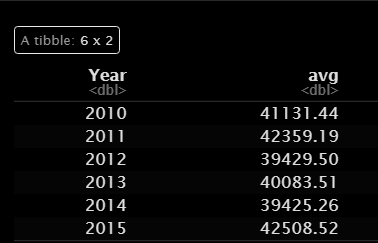
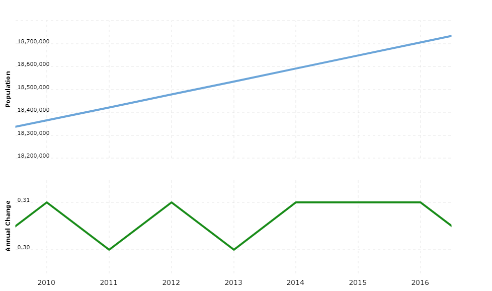

## Things to consider:
* Why is there a decrease in the mean of total waste tonnage collected from the Bronx from 2010 - 2015?
 
  + The professors hypothesis of the decreasing average of waste tonnage collected in the Bronx is semi-true. The average total waste tonnage collected decreased during 2012, 2013 and 2014. 
  

* Did the DSNY collect waste thoroughly during that time?
  + Perhaps there was an exodus of people leaving NYC?

> A plot from [macrotrends.net](https://www.macrotrends.net/cities/23083/new-york-city/population) \nshows that NYC Metro area population had increased from 2010 to 2015. 

* Investigate the increase in 2020 waste tonnage
  + Perhaps the pandemic was the route cause of this 
    + Yeah, an article from [Bloomberg](https://www.bloomberg.com/news/articles/2020-09-29/for-cities-2020-really-is-a-garbage-year) from 2020 wrote that this was common throughout the country. Municipal agencies put into effect a hiring freeze on sanitation departments. Leaving the sanitation workforce without adequate manpower and equipment when residential waste picked up. 
    
* Research the textbook to take into account seasonality

## Goal for next meeting:
* Create a new ARIMA forecast on total_waste values
  + p=0, 1, 2
  + q=0, 1, 2
  + look at AIC and BIC
* Update the fourth meeting word document
  + Prioritize updating the ARIMA models
  + Add a forecasting precision
  + Add prediction accuracy
  + Add the forecast models onto a plot with either the total waste values or differenced values
* Explore the economic index, as a predictor variable
* Then try population values if possible
  + You will need to find them per month, and specifically for each borough
* With time permitting, explore dynamic regression

